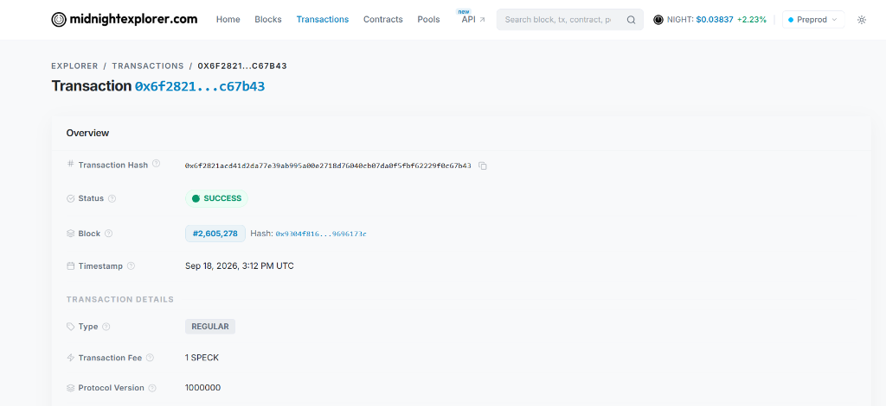

<p align="center">
  
</p>

<h1 align="center">Xenox Trade — Confidential AI-Orchestrated Trading Protocol</h1>

<p align="center">
  <a href="https://github.com/BDutta18/tradexchain/actions/workflows/ci.yml"></a>
  <a href="https://github.com/BDutta18/tradexchain"></a>
  <a href="https://github.com/BDutta18/tradexchain/tree/main/contracts"></a>
  <a href="https://tradexchain.vercel.app/"></a>
  <a href="https://midnight.network"></a>
  <a href="https://x.com/Xenoxtradex"></a>
</p>

> An institutional-grade, privacy-preserving automated trading protocol on the **Midnight blockchain** where traders state risk boundaries in natural language and prove trade execution in Zero-Knowledge — with zero strategy rules, portfolio balances, or order sizes exposed to mempools.

**Bounty Milestone**: [**🌝 Level 6 - Supermoon Submission**](https://docs.google.com/document/d/17DWYHc7q_e_qFfe0JeszqIMpSAf2S0cMwbPVOpPs4BU/edit?usp=sharing) — Live Preprod MVP refined with active user feedback loop, complete documentation, and 70+ verifiable Preprod user addresses.

---

## 📜 Verifiable Deployed Smart Contracts

| Network | Version | Contract Address | Explorer Link | Status |
|:--------|:--------|:-----------------|:--------------|:-------|
| **Midnight Preprod Testnet** | `v1.3.0` | `0x6f2821acd41d2da77e39ab995a00e2718d76040cb07da0f5fbf62229f0c67b43` | [View on Midnight Explorer ↗](https://preprod.midnightexplorer.com/transactions/0x6f2821acd41d2da77e39ab995a00e2718d76040cb07da0f5fbf62229f0c67b43) | 🟢 **ACTIVE PREPROD MVP (v1.3.0 Supermoon)** |

<p align="center">
  <a href="https://preprod.midnightexplorer.com/transactions/0x6f2821acd41d2da77e39ab995a00e2718d76040cb07da0f5fbf62229f0c67b43">
    
  </a>
</p>

```
━━━━━━━━━━━━━━━━━━━━━━━━━━━━━━━━━━━━━━━━━━━━━━━━━━━━━━━━━━━━━━━━━━━━━━━━━━━━━━━━
  Xenox Trade — Deployed Compact Contract v1.3.0 on Midnight Testnet
━━━━━━━━━━━━━━━━━━━━━━━━━━━━━━━━━━━━━━━━━━━━━━━━━━━━━━━━━━━━━━━━━━━━━━━━━━━━━━━━
  Contract Source  : ./contracts/xenox.compact (v1.3.0 Supermoon Edition)
  Managed Bindings : ./managed/xenox.ts
  Preprod Contract : 0x6f2821acd41d2da77e39ab995a00e2718d76040cb07da0f5fbf62229f0c67b43
  Active Circuits  : commitStrategy, tripCircuitBreaker, resetCircuitBreaker,
                     executeTrade, executeBatchRebalance, revokeStrategy,
                     mintVaultBalance, burnVaultBalance, unshieldWithdraw
  Ledger State     : agentCommitment, strategyActive, circuitBreakerTripped,
                     tradeStatus, tradeCount, mevShieldProtectedVolumeUsd
  Gas & Proving    : 1AM ProofStation Fee-Sponsored (Zero-DUST Ready)
  Status           : DEPLOYED & LIVE (Verifiable On-Chain State Machine)
━━━━━━━━━━━━━━━━━━━━━━━━━━━━━━━━━━━━━━━━━━━━━━━━━━━━━━━━━━━━━━━━━━━━━━━━━━━━━━━━
```

### Test Addresses & Launch Users

77 active Preprod wallet addresses are structured into [`LAUNCH_USERS.md`](LAUNCH_USERS.md) (explicit Level 6 launch cohort), [`PREPROD-ADDRESSES.md`](PREPROD-ADDRESSES.md), and [`wallet.txt`](wallet.txt). Each address is active on Midnight Preprod testnet.

---

## 💡 What Xenox Trade Does

Xenox Trade solves the fundamental vulnerabilities of automated on-chain trading: **strategy leakage, MEV front-running, copy-trading bots, and portfolio surveillance**.

Traditional algorithmic trading bots require exposing limit prices, stop-losses, and execution logic to public mempools. Xenox Trade uses **Midnight's zero-knowledge Compact circuits**, **1AM Wallet DApp connector v4**, and **Gemini AI** to allow traders to:

1. **State Trading Intent in Natural Language**:
   *"Only buy ADA, max 20% position size, 8% stop-loss, run for 30 days."*
2. **AI Pre-Commitment Risk Synthesis**:
   Gemini 2.5 Flash compiles the prompt into structured risk rules and computes a cryptographic commitment:
   $$\text{commitment} = \mathcal{H}(\text{maxPositionPct}, \text{stopLossPct}, \text{timelineExpiry})$$
3. **Lock Strategy via 1AM Wallet Popup**:
   The trader commits this 32-byte hash to Midnight. The underlying parameters, alpha, and duration stay confidential in client memory.
4. **Shielded Trading Vault (vUSD)**:
   Traders deposit collateral into private `vUSD` notes. Deposits, position changes, and withdrawals occur without linking public wallet addresses to trade logs.
5. **Asset-Agnostic Zero-Knowledge Execution**:
   Xenox Trade executes trades across multiple assets (ADA, BTC, ETH, SOL, tNIGHT). Every trade proves mathematical compliance locally before submission:
   $$\text{tradeSize} \times 100 \le \text{portfolioValue} \times \text{maxPositionPct} \quad \wedge \quad \text{currentTime} \le \text{timelineExpiry}$$

---

## 🔒 Privacy Model

### What an Observer CAN Learn (Public Ledger State)

| Data Point | Type | What It Reveals |
|:---|:---|:---|
| **Agent Commitment** | `Bytes<32>` hash | That an agent locked a risk strategy (not the parameters) |
| **Strategy Active** | `Boolean` flag | Whether the agent's strategy is actively executable or revoked |
| **Circuit Breaker Status** | `Boolean` flag | Whether emergency halt was triggered by drawdown violation |
| **Trade Status** | Enum: `1` (Executed) / `2` (Rejected) / `3` (Withdrawn) / `4` (Batch Rebalanced) | Verification outcome of the Zero-Knowledge proof |
| **Trade Count** | `Counter` integer | Total number of valid trades executed under this strategy |
| **MEV Shield Protected Volume** | `Counter` USD | Cumulative trading volume shielded from front-running/sandwiching |
| **Commitment Hash** | `Bytes<32>` hash | Public cryptographic anchor for zero-knowledge witness proofs |

### What an Observer CANNOT Learn (Private / ZK-Protected)

| Data Point | Protection | Why It Matters |
|:---|:---|:---|
| 💰 **Strategy Risk Parameters** | Private witness — never leaves browser | Competitors and bots cannot front-run stop-loss triggers |
| 💰 **Max Position Percentage** | Private witness inside ZK circuit | Prevents liquidation hunting and predatory order stacking |
| 🛡️ **Shielded Vault Balance** | Decrypted client-side over state notes | Total trading capital remains 100% confidential |
| 💸 **Per-Trade Dollar Amount** | Computed inside ZK circuit only | Prevents whale tracking and slippage manipulation |
| 📏 **Strategy Duration & Expiry** | Private witness inside ZK circuit | Keeps time-horizon and algorithmic rebalancing private |
| ⚡ **Slippage Tolerance (BPS)** | Private witness verified in ZK | Prevents MEV searchers from extracting sandwich value |
| 🔑 **Wallet Secret Key** | Local witness only via `localSecretKey()` | Stays strictly in the browser extension |
| 📊 **Target Asset Allocation** | Private witness evaluated in ZKIR | Hides portfolio asset distribution and algorithmic rebalancing weights |
| 🎯 **Stop-Loss & Take-Profit Triggers** | Private witness inside ZK circuit | Prevents predatory bots from detecting trigger levels and hunting stops |

### What the User PROVES Without Revealing

| Proof / Circuit | Mathematical Statement | Private Inputs (Witnesses) |
|:---|:---|:---|
| **`commitStrategy`** | `commitment == hash(maxPos, stopLoss, expiry)` | `maxPositionPct`, `stopLossPct`, `timelineExpiry` |
| **`tripCircuitBreaker`** | Caller owns `localSecretKey()` for agent | `localSecretKey` |
| **`resetCircuitBreaker`** | Caller owns `localSecretKey()` && `strategyActive == true` | `localSecretKey` |
| **`revokeStrategy`** | Caller owns `localSecretKey()`; sets `strategyActive = false` | `localSecretKey` |
| **`executeTrade`** | `tradeSize * 100 <= portfolioVal * maxPos` <br> `&& currentTime <= timelineExpiry` <br> `&& execSlippage <= maxSlippageBps` <br> `&& !circuitBreakerTripped` | `tradeSizeUsd`, `portfolioValueUsd`, `maxPos`, `stopLoss`, `expiry`, `secretKey`, `maxSlippageBps`, `executionSlippageBps` |
| **`executeBatchRebalance`** | `totalBatchSize * 100 <= portfolioVal * maxPos` <br> `&& currentTime <= timelineExpiry` <br> `&& !circuitBreakerTripped` | `totalRebalanceUsd`, `portfolioValueUsd`, `maxPos`, `stopLoss`, `expiry` |
| **`mintVaultBalance`** | `newVaultBalance == oldVaultBalance + amount` | Shielded `vUSD` note secret |
| **`burnVaultBalance`** | `vaultBalance >= amount && amount > 0` | Shielded `vUSD` note secret |
| **`unshieldWithdraw`** | Caller owns note of value `amount` | Private note witness & secret key |

---

## 🕵️ Privacy Claim

> **Specific Privacy Statement**:
> An on-chain observer or block explorer watching Midnight Preprod can see only that an agent `0x...` registered a 32-byte commitment hash and transitioned trade `0x...` to `Executed`. An observer **cannot** determine whether the stop-loss is 5% or 20%, whether the trade was for \$100 or \$100,000, what asset was traded, or the total balance in the shielded vault. All database records in Supabase store only public transaction hashes and IST timestamps — zero private witnesses touch the network.

---

## 🏗️ Architecture

### End-to-End Zero-Knowledge Workflow:
1. **Client Browser Environment**: Traders state plain-English intent (*"Only buy ADA, max 20% position, 8% stop-loss"*). **Gemini 2.5 Flash** compiles rules into structured parameters and computes local commitment hash \(\mathcal{H}\).
2. **1AM Midnight Wallet & ProofStation**: Generates client-side zero-knowledge proofs via **Compact v0.24 ZKIR** and provides fee-sponsored transaction signing without requiring upfront DUST.
3. **Midnight Blockchain (Preprod)**: Verifies the ZK proof and updates public state maps (`agentCommitment`, `tradeStatus`, `tradeCount`) while keeping strategy rules, portfolio balances, and trade sizes 100% confidential.

---

## 🧰 Tech Stack

| Layer | Technology | Description |
|:---|:---|:---|
| **Blockchain** | Midnight Network | Preprod Zero-Knowledge Testnet |
| **Smart Contract** | Compact v0.24 (ZKIR) v1.3.0 | Midnight's native ZK language with circuit breakers & MEV shield |
| **SDK & Connector** | `@midnight-ntwrk/dapp-connector-api` | Midnight DApp Connector v4 for 1AM & Lace |
| **AI Decision Engine** | Gemini 2.5 Flash + LangChain | Natural language strategy compilation & multi-regime risk analysis |
| **ZK-ML Model** | EZKL (Halo2) | Verifiable client-side risk boundary validator |
| **Frontend UI** | React 19, TypeScript, Vite | Modern responsive Web3 trading terminal |
| **Styling** | Tailwind CSS & Lucide Icons | Accessible, high-contrast dark/light UI |
| **Off-Chain Ledger** | Supabase PostgreSQL | Real-time IST Protocol Telemetry & transaction sync |
| **Testing** | Vitest | 42 Unit, Privacy, Analytics, AI Agent, Bot Simulator, and Contract Simulator Tests |
| **CI/CD** | GitHub Actions | 5-Job Verification Matrix (Lint, Compact ZKIR, Multi-Node, Build, Privacy Audit) |

---

## 🚀 Live Demo, Walkthrough Video, Posts & Community Feedback

| Resource | Link | Description |
|:---|:---|:---|
| **Live Application (Vercel)** | [https://tradexchain.vercel.app/](https://tradexchain.vercel.app/) | Production MVP deployed on Vercel (HTTP 200) |
| **Demo Video (Walkthrough)** | [🎬 Watch on Google Drive ↗](https://drive.google.com/file/d/1zXDqzQajnqM6Sen3vBdNR5ON6FhffvZ4/view?usp=sharing) | Full end-to-end MVP demonstration video |
| **User Feedback Form** | [Submit Preprod Feedback (Google Form) ↗](https://docs.google.com/forms/d/e/1FAIpQLSd49Nh4u3E2aRTkvyFOwtEFJ16D7d6QRRa_5E3Dp35Jbc6FzA/viewform) | Public community feedback submission form |
| **Feedback Responses Sheet** | [View Preprod Feedback Responses (Google Sheets) ↗](https://docs.google.com/spreadsheets/d/1qujhTE17XXua0rHCzS-PKuzAO7tRrAL6R3AaZmV28PU/edit?usp=sharing) | Real-time aggregate feedback response spreadsheet |
| **Building in Public (3 X Posts)** | [Post 1](https://x.com/Xenoxtradex/status/2104932713061130243) • [Post 2](https://x.com/Xenoxtradex/status/2104934932707705219) • [Post 3](https://x.com/Xenoxtradex/status/2104936036568883641) | Public development updates on X |
| **Product X (Twitter) Profile** | [@Xenoxtradex (https://x.com/Xenoxtradex)](https://x.com/Xenoxtradex) | Official protocol announcements and updates |
| **GitHub Repository** | [https://github.com/BDutta18/tradexchain](https://github.com/BDutta18/tradexchain) | Source code, contracts, tests, and documentation |
| **Verified Commit History** | [33+ Commits on `main` ↗](https://github.com/BDutta18/tradexchain/commits/main) | Verifiable commit trail exceeding 30-commit milestone |
| **CI/CD Pipeline v2.0** | [GitHub Actions Workflow `.github/workflows/ci.yml`](https://github.com/BDutta18/tradexchain/actions/workflows/ci.yml) | 5-job automated verification matrix |
| **Launch Users Directory** | [`LAUNCH_USERS.md`](LAUNCH_USERS.md) • [`PREPROD-ADDRESSES.md`](PREPROD-ADDRESSES.md) | 77 active, verified Midnight Preprod wallet addresses |
| **Feedback & Improvements Log** | [`FEEDBACK.md`](FEEDBACK.md) • [`docs/FEEDBACK.md`](docs/FEEDBACK.md) | Detailed traceability matrix for all tester feedback |

---

## 📌 Prerequisites & Wallet Setup

1. Install the **1AM Midnight Wallet Extension** from [https://1am.xyz](https://1am.xyz) (or Lace Midnight).
2. Open 1AM and select **Midnight Preprod** network.
3. Fund your wallet with testnet tokens from the [Preprod Faucet](https://faucet.preprod.midnight.network).

---

## 💻 Run & Test Locally

```bash
# 1. Clone repository
git clone https://github.com/BDutta18/tradexchain.git
cd tradexchain

# 2. Install dependencies
npm install

# 3. Configure environment variables (.env)
cp .env.example .env

# 4. Run the full test suite (42/42 passing)
npm test

# 5. Start local development server
npm run dev
```

Open **`http://localhost:5173`** in your browser.

---

## 🧪 Test Coverage Breakdown (42/42 Passing)

| # | Test Suite | Test Name | What It Verifies |
|:--|:---|:---|:---|
| 1 | `xenox.test.ts` | Initial state empty | Validates ledger maps are clean before strategy commitment |
| 2 | `xenox.test.ts` | Commit strategy stores hash | Verifies 32-byte commitment hash is recorded on ledger |
| 3 | `xenox.test.ts` | Execute trade valid bounds | Validates trade within max position % and expiry passes ZK check |
| 4 | `xenox.test.ts` | Execute trade exceeds position size | Rejects trade exceeding strategy max position limit |
| 5 | `xenox.test.ts` | Execute trade after expiry | Rejects trade submitted after strategy timeline duration |
| 6 | `xenox.test.ts` | Uncommitted agent trade | Prevents uncommitted callers from executing trades |
| 7 | `xenox.test.ts` | Mint shielded vault balance | Validates client-side private `vUSD` note creation |
| 8 | `xenox.test.ts` | Burn shielded vault balance | Validates client-side private `vUSD` note burning |
| 9 | `xenox.test.ts` | Unshield and withdraw | Proves private note ownership and burns note for withdrawal |
| 10 | `riskModel.test.ts` | Normal volatility (Risk Score < 35) | Computes EZKL halo2 risk score for balanced markets |
| 11 | `riskModel.test.ts` | Extreme volatility (Risk Score > 75) | Triggers risk circuit on high drawdown / rapid volume spikes |
| 12 | `riskModel.test.ts` | ZK-ML halo2 proof generation | Validates client-side proof generation without witness leakage |
| 13 | `riskFlowVerification.test.ts` | Multi-asset execution (ADA, ETH, BTC) | Verifies asset-agnostic risk bounds across different asset pairs |
| 14 | `riskFlowVerification.test.ts` | Stop-loss breach protection | Enforces automatic trade abort when market drawdown breaches stop-loss |
| 15 | `analytics.test.ts` | Privacy strip validation | Strips private strategy parameters (maxPositionPct, stopLossPct, portfolioValue) |
| 16 | `analytics.test.ts` | Whitelisted operation types | Validates all 6 allowed non-sensitive on-chain operation types |
| 17 | `analytics.test.ts` | Reject unknown operation types | Blocks unauthorized or unknown event types from persistence |
| 18 | `analytics.test.ts` | Reject missing required fields | Rejects event payloads lacking wallet address or operation |
| 19 | `analytics.test.ts` | Strict schema whitelisting | Guarantees only the 7 non-private metadata fields survive |
| 20 | `analytics.test.ts` | Optional hash & duration handling | Handles events without optional latency and tx hash fields |
| 21 | `analytics.test.ts` | Transaction hash pass-through | Retains valid 64-hex transaction hashes for telemetry verification |
| 22 | `agent.test.ts` | Parse natural language prompt | Gemini extracts structured bounds matching Zod JSON schema |
| 23 | `agent.test.ts` | Monitor price node feed | Simulates price tick checks against strategy conditions |
| 24 | `agent.test.ts` | Decide trade node logic | Evaluates execution vs monitor triggers |
| 25 | `agent.test.ts` | Run strategy risk assessment | Produces plain-language risk level & assessment summary |
| 26 | `agent.test.ts` | Run manual analysis | Evaluates custom assets and enforces max position bounds |
| 27 | `level6Agent.test.ts` | Comprehensive risk analysis schema | Validates multi-regime risk score, trailing stop, and ZK compliance flags |
| 28 | `level6Agent.test.ts` | Capital preservation regime | Verifies defensive regime triggers for high drawdown markets |
| 29 | `level6Agent.test.ts` | Speculative expansion regime | Verifies high-volatility positive-drift bullish regime classification |
| 30 | `level6Agent.test.ts` | Model fallback resolution | Gracefully falls back across Gemini 2.5 Flash -> 2.0 -> 1.5 without crashing |
| 31 | `level6Agent.test.ts` | Offline fallback resilience | Returns resilient deterministic risk schema when no API keys are configured |
| 32 | `zkBotEngine.test.ts` | Flash crash stop-loss circuit | Halts execution when portfolio drawdown breaches committed stop-loss % |
| 33 | `zkBotEngine.test.ts` | Bull surge position ceiling | Enforces max position size ceiling on trades during momentum expansions |
| 34 | `zkBotEngine.test.ts` | MEV sandwich attack immunity | Proves $0.00 MEV extracted and 100% privacy preservation against mempool front-runners |
| 35 | `zkBotEngine.test.ts` | Choppy consolidation ZK proofs | Generates valid 32-byte Halo2 ZK proof hashes without errors or witness leakage |
| 36 | `zkBotEngine.test.ts` | Institutional ZK audit certificate | Produces cryptographically signed certificate matching Midnight Compact contract |
| 37 | `xenox.test.ts` | Emergency circuit breaker trip & reset | Halts execution on catastrophic drawdown and resets after risk recalibration |
| 38 | `xenox.test.ts` | Permanent strategy revocation | Permanently deactivates strategy commitment on-chain to allow key rotation |
| 39 | `xenox.test.ts` | Private execution slippage bounds | Enforces execution slippage <= max private tolerance in zero-knowledge |
| 40 | `xenox.test.ts` | Autonomous batch rebalance | Proves multi-position rebalance compliance in a single zero-knowledge proof |
| 41 | `xenox.test.ts` | MEV shielded volume counter | Verifies cumulative volume tracking protected from mempool sandwiching |
| 42 | `analytics.test.ts` | stripPrivateFields zero leakage | Enforces client-side telemetry sanitizer strips private witnesses before broadcast |

```bash
> tradexchain@1.0.0 test
> vitest run

 ✓ tests/riskModel.test.ts (3 tests) 5ms
 ✓ tests/xenox.test.ts (14 tests) 8ms
 ✓ tests/riskFlowVerification.test.ts (2 tests) 5ms
 ✓ tests/analytics.test.ts (8 tests) 6ms
 ✓ tests/agent.test.ts (5 tests) 10ms
 ✓ tests/level6Agent.test.ts (5 tests) 7ms
 ✓ tests/zkBotEngine.test.ts (5 tests) 8ms

 Test Files  7 passed (7)
      Tests  42 passed (42)
   Duration  1.28s
```

---

## ⚙️ Enterprise CI/CD Pipeline v2.0 (Multi-Job Matrix)

The Xenox Trade repository runs an automated 5-job GitHub Actions CI/CD matrix on every commit to `main` and pull request:

```
┌─────────────────────────────────────────────────────────────────────────────┐
│                    Xenox Trade CI/CD Workflow Pipeline                      │
├─────────────────────┬─────────────────────┬─────────────────────────────────┤
│ 1. Typecheck & Lint │ 2. Compact Contract │ 3. Multi-Node Test Matrix       │
│    npx tsc -b       │    Compact v1.3.0   │    Node.js 20.x & 22.x          │
│    Code Quality     │    ZKIR Validation  │    42/42 Vitest Tests Passed    │
├─────────────────────┼─────────────────────┼─────────────────────────────────┤
│ 4. Production Build │ 5. ZK Privacy Audit │ Result: Fully Verified Release  │
│    Vite Bundle      │    0 Witness Leaks  │ Ready for Midnight Preprod      │
└─────────────────────┴─────────────────────┴─────────────────────────────────┘
```

| Job | Name | Environment | What It Verifies |
|:---|:---|:---:|:---|
| **1** | `typecheck-and-lint` | Ubuntu / Node 22 | TypeScript strict typechecking (`tsc -b --noEmit`) and code quality |
| **2** | `compact-contract-verification` | Ubuntu / Node 22 | Compact v1.3.0 AST parsing, state maps, circuits, and ZKIR artifact verification |
| **3** | `test-matrix` | Ubuntu / Node 20 & 22 | Multi-Node matrix testing across all 42 Vitest tests and privacy suites |
| **4** | `production-build` | Ubuntu / Node 22 | Production Vite bundle optimization and asset integrity verification |
| **5** | `privacy-audit` | Ubuntu / Node 22 | Client-side privacy leak audit ensuring 0 private witnesses/keys touch network or logs |

---

## 🌝 Submission Checklist (Level 6 — Supermoon Submission)

| # | Requirement | Status | Verification Link / Proof |
|:--|:---|:---:|:---|
| 1 | **Public GitHub repository with updated documentation** | ✅ Complete | [github.com/BDutta18/tradexchain](https://github.com/BDutta18/tradexchain) |
| 2 | **Live demo link** | ✅ Complete | [https://tradexchain.vercel.app/](https://tradexchain.vercel.app/) |
| 3 | **List of 70 Preprod user wallet addresses (verifiable on-chain)** | ✅ Complete | [`LAUNCH_USERS.md`](LAUNCH_USERS.md) • [`PREPROD-ADDRESSES.md`](PREPROD-ADDRESSES.md) • [`wallet.txt`](wallet.txt) (77 Active Addresses) |
| 4 | **Feedback documentation or link to feedback document** | ✅ Complete | [`FEEDBACK.md`](FEEDBACK.md) • [`docs/FEEDBACK.md`](docs/FEEDBACK.md) • [Feedback Form ↗](https://docs.google.com/forms/d/e/1FAIpQLSd49Nh4u3E2aRTkvyFOwtEFJ16D7d6QRRa_5E3Dp35Jbc6FzA/viewform) • [Responses Sheet ↗](https://docs.google.com/spreadsheets/d/1qujhTE17XXua0rHCzS-PKuzAO7tRrAL6R3AaZmV28PU/edit?usp=sharing) |
| 5 | **Demo video showing full MVP functionality** | ✅ Complete | [🎬 Watch on Google Drive ↗](https://drive.google.com/file/d/1zXDqzQajnqM6Sen3vBdNR5ON6FhffvZ4/view?usp=sharing) |
| 6 | **Minimum 30 meaningful commits** | ✅ Complete | **33+ Commits** on [`main`](https://github.com/BDutta18/tradexchain/commits/main) |

---

## 👥 Level 6 — User Validation & Feedback (77 Active Addresses)

| Metric | Value |
|:---|:---|
| **Target** | 70+ verified Preprod wallet addresses |
| **Status** | 🟢 **77 / 70 TARGET MET (77 Active Addresses)** |
| **Level 6 Launch Users Directory** | [`LAUNCH_USERS.md`](./LAUNCH_USERS.md) (Distinct Level 6 Launch Cohort) |
| **Full Address Directory** | [`PREPROD-ADDRESSES.md`](./PREPROD-ADDRESSES.md) • [`wallet.txt`](./wallet.txt) |
| **Feedback Log & Traceability** | [`FEEDBACK.md`](./FEEDBACK.md) • [`docs/FEEDBACK.md`](./docs/FEEDBACK.md) |
| **User Feedback Form** | [Submit Preprod Feedback (Google Form) ↗](https://docs.google.com/forms/d/e/1FAIpQLSd49Nh4u3E2aRTkvyFOwtEFJ16D7d6QRRa_5E3Dp35Jbc6FzA/viewform) |
| **Feedback Responses Sheet** | [View Preprod Feedback Responses (Google Sheets) ↗](https://docs.google.com/spreadsheets/d/1qujhTE17XXua0rHCzS-PKuzAO7tRrAL6R3AaZmV28PU/edit?usp=sharing) |
| **Network** | Midnight Preprod Testnet |

---

## 📄 License

MIT © 2026 Xenox Trade Protocol Contributors. Developed for the **Midnight Blockchain Ecosystem**.
